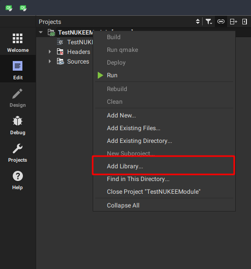

# NukeEngine Sample module

This project is for demonstration of abilities of modularity of NukeEngine.

You can develop your own modules for a game or editor, using this template.


## Instalation
Just clone this repo into NukeEngine projects root directory (Where is NukeEngine directory too), check dependency to NukeEngine library, and do something awesome!)

If dependency is broken, delete next lines in `.pro` file, and add new library to project again:
```
win32:CONFIG(release, debug|release): LIBS += -L$$PWD/../NukeEngine/build/debug/ -lNukeEngine
else:win32:CONFIG(debug, debug|release): LIBS += -L$$PWD/../NukeEngine/build/debug/ -lNukeEngine
else:unix: CONFIG(debug, debug|release): LIBS += -L$$PWD/../NukeEngine/build/debug/ -lNukeEngine

INCLUDEPATH += $$PWD/../NukeEngine
DEPENDPATH += $$PWD/../NukeEngine
```

-----
Adding library:



-----

Check "External library" and click `next`:


-----

And choose path to library file you have built before and path to its root folder (Where are sources): 


-----

Next, finish and all done!

Customize your pasted into `.pro` file lines if you are going to make a release build: for release folder.

----

## Develop

For more information look the [testnukeemodule.h](testnukeemodule.h), it has to be good commented.